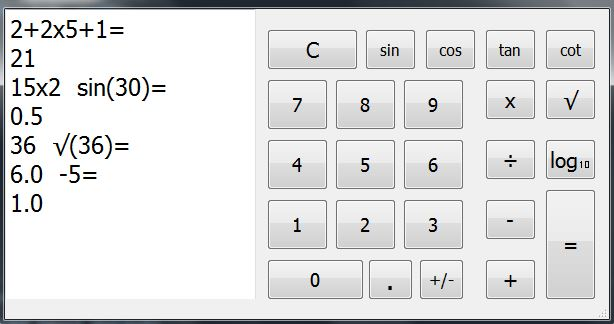

### A calculator program using PyQt5 library
\

**Warning:** this calculator doesn't support operator precedence YET.(COPIUM)
\
As you can see in the first example the answer for 2+2x5+1 is  21 not 13.
\
So it's safe to say you might not want to try this program on your stock market calculations if you want to go to the moon 🚀🚀